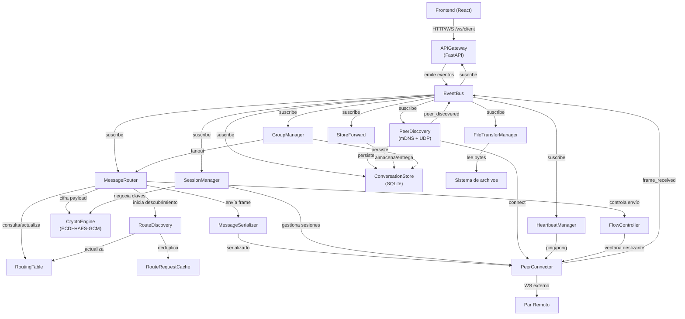
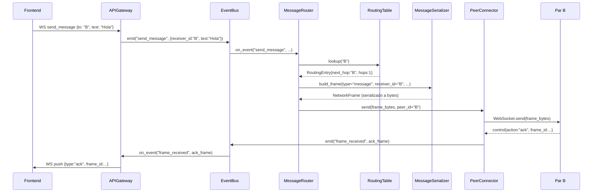
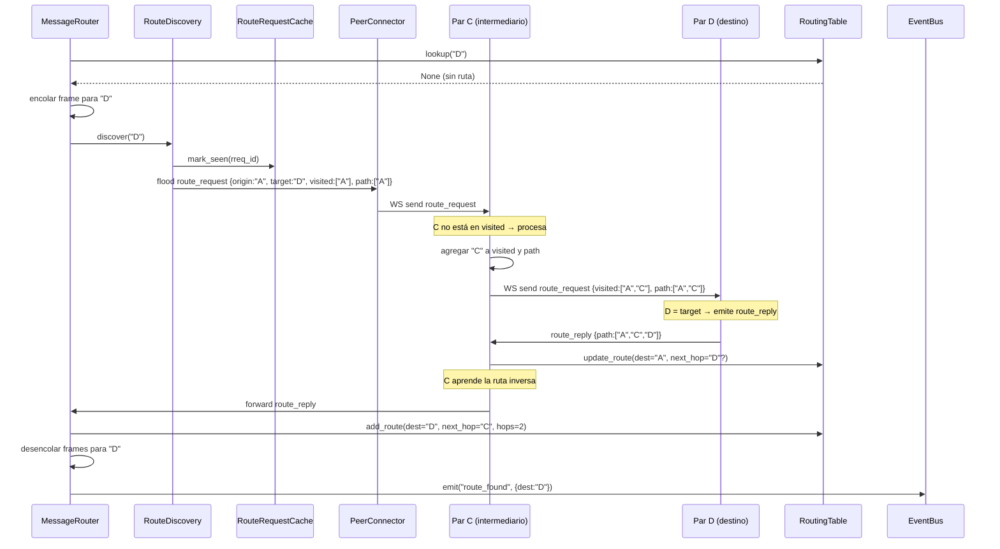
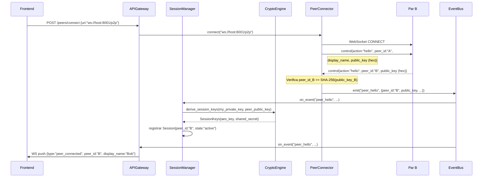
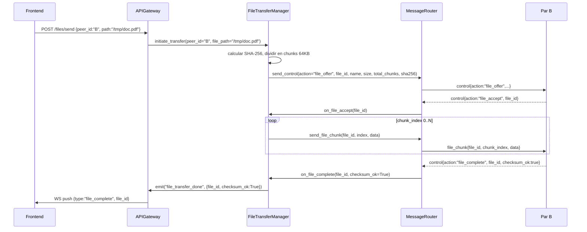
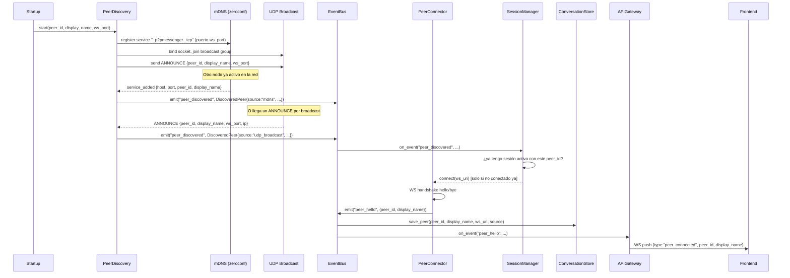
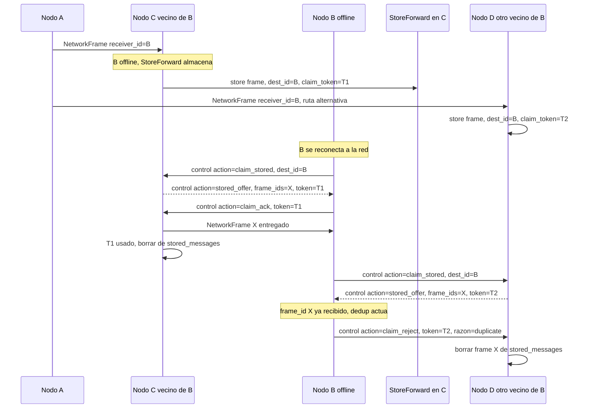
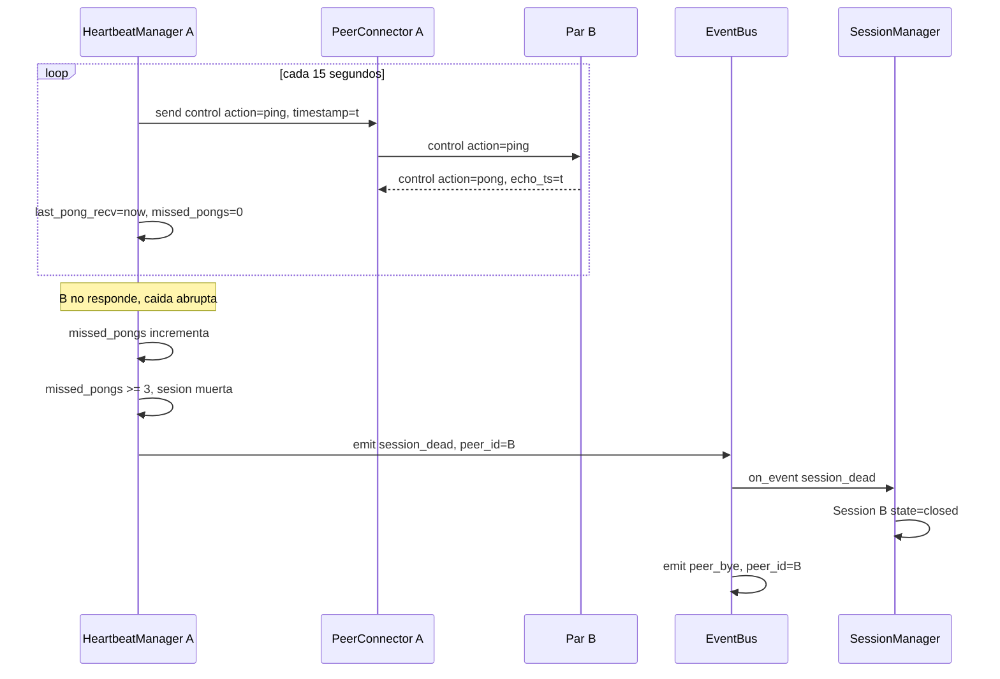
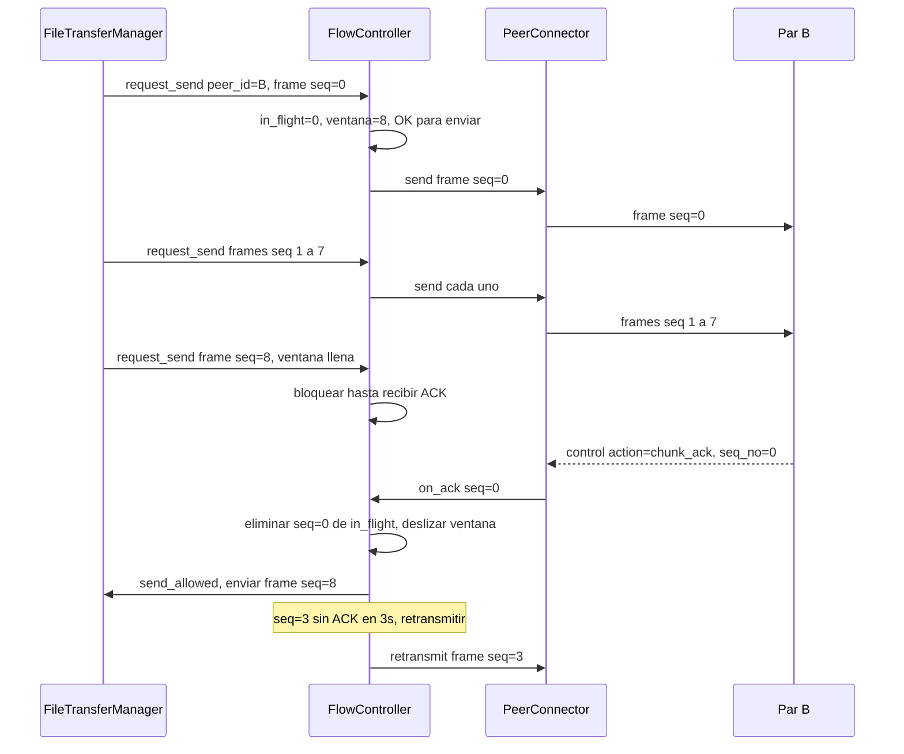
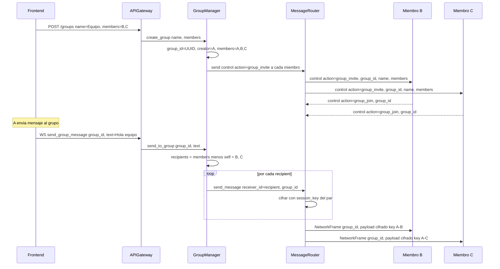

# Plan de Construcción — Sistema de Mensajería P2P

Traducción del planteamiento formal del README a una hoja de ruta concreta: estructura de módulos, modelo de datos completo (esquema SQLite + estructuras en memoria) e interacciones entre componentes con diagramas de secuencia y flujos de eventos.

> **Actualizaciones:** `PeerDiscovery` (mDNS + UDP), identidad criptográfica (clave pública), E2EE (ECDH + AES-GCM), `StoreForward` con deduplicación, `HeartbeatManager`, control de flujo con ventana deslizante, y mensajería de grupo.

---

## Modelo de Datos

### 1. Estructuras en Memoria (Python dataclasses / TypedDicts)

#### `NetworkFrame` — unidad atómica de transporte

```python
@dataclass
class NetworkFrame:
    frame_id:    str          # UUID v4
    frame_type:  Literal["message", "file_chunk", "control"]
    sender_id:   str          # peer_id = SHA-256(public_key) del origen
    receiver_id: str          # peer_id del destino final (o group_id)
    route:       list[str]    # e.g. ["A", "C", "D"]
    hop_index:   int          # índice actual dentro de route
    timestamp:   float        # unix epoch (time.time())
    payload:     bytes        # cifrado con AES-GCM usando la sesión compartida
    seq_no:      int          # número de secuencia por sesión (para orden y dedup)
    group_id:    str | None   # presente sólo en mensajes de grupo
```

> **Serialización:** envelope JSON (todos los campos excepto `payload`) + payload como base64 dentro del JSON, o como campo binario separado si el transporte lo permite.

#### `RouteRequestFrame` — control interno de descubrimiento

```python
@dataclass
class RouteRequestFrame:
    rreq_id:   str        # UUID único por búsqueda
    origin_id: str
    target_id: str
    visited:   set[str]   # nodos que ya procesaron este RREQ
    path:      list[str]  # ruta acumulada para construir el route_reply
```

#### `RoutingEntry` — entrada de la tabla de enrutamiento

```python
@dataclass
class RoutingEntry:
    dest_id:     str
    next_hop_id: str
    hops:        int
    last_seen:   float    # unix epoch; usado para invalidación
```

#### `Session` — sesión P2P activa

```python
@dataclass
class Session:
    peer_id:      str
    display_name: str
    ws_uri:       str
    connected_at: float
    state:        Literal["handshaking", "active", "closing", "closed"]
```

#### `DiscoveredPeer` — nodo encontrado durante el descubrimiento

```python
@dataclass
class DiscoveredPeer:
    peer_id:      str
    display_name: str
    ws_uri:       str          # "ws://192.168.1.42:8765/p2p"
    public_key:   bytes        # clave pública ECDH (curva X25519), 32 bytes
    discovered_at: float       # unix epoch
    source:       Literal["mdns", "udp_broadcast", "manual"]
```

#### `Identity` — identidad local del nodo

```python
@dataclass
class Identity:
    peer_id:     str           # SHA-256(public_key) en hex, 64 chars
    public_key:  bytes         # X25519 public key, 32 bytes
    private_key: bytes         # X25519 private key, 32 bytes (no sale del nodo)
    display_name: str

# Derivación:
# private_key = X25519PrivateKey.generate()
# public_key  = private_key.public_key().public_bytes(...)
# peer_id     = hashlib.sha256(public_key).hexdigest()
```

#### `SessionKeys` — claves derivadas por sesión E2EE

```python
@dataclass
class SessionKeys:
    peer_id:       str
    shared_secret: bytes    # ECDH output, 32 bytes
    aes_key:       bytes    # HKDF(shared_secret, "aes"), 32 bytes → AES-256-GCM
    established_at: float
```

#### `StoredMessage` — mensaje guardado en vecino para entrega asíncrona

```python
@dataclass
class StoredMessage:
    frame_id:    str           # ID del frame original
    dest_id:     str           # destino offline
    payload:     bytes         # frame completo serializado
    stored_at:   float
    ttl_seconds: int = 86400   # 24 h; descartado si expira
    claim_token: str = field(default_factory=lambda: uuid4().hex)
    # claim_token: token de un solo uso que el destino usa para colectar el mensaje
    # Garantiza que solo un vecino entrega el mensaje final
```

#### `FlowWindow` — estado de la ventana deslizante por sesión

```python
@dataclass
class FlowWindow:
    peer_id:        str
    window_size:    int = 8        # máximo de frames sin ACK simultáneos
    in_flight:      dict[int, float] = field(default_factory=dict)
    # seq_no → timestamp de envío
    next_seq:       int = 0
    last_ack:       int = -1
    retransmit_timeout: float = 3.0   # segundos antes de reenviar
```

#### `HeartbeatState` — salud de conexión por sesión

```python
@dataclass
class HeartbeatState:
    peer_id:         str
    interval:        float = 15.0    # segundos entre pings
    timeout:         float = 45.0    # sin pong → sesión considerada muerta
    last_ping_sent:  float = 0.0
    last_pong_recv:  float = 0.0
    missed_pongs:    int = 0
```

#### `Group` — grupo de mensajería

```python
@dataclass
class Group:
    group_id:    str           # UUID administrado por el creador
    name:        str
    creator_id:  str           # peer_id del creador
    members:     set[str]      # peer_ids de todos los miembros
    created_at:  float
```

#### `FileTransfer` — estado de una transferencia en curso

```python
@dataclass
class FileTransfer:
    file_id:       str        # UUID
    name:          str
    size_bytes:    int
    total_chunks:  int
    chunk_size:    int        # default 65536 (64 KB)
    sha256:        str        # hash del archivo completo
    direction:     Literal["sending", "receiving"]
    peer_id:       str
    received_chunks: dict[int, bytes]   # sólo en recepción
    sent_chunks:   set[int]             # sólo en envío
    state:         Literal["offered","accepted","in_progress","complete","failed"]
```

---

### 2. Esquema de Base de Datos — SQLite (aiosqlite)

```sql
-- Pares conocidos por esta instancia
CREATE TABLE IF NOT EXISTS peers (
    peer_id      TEXT PRIMARY KEY,
    display_name TEXT NOT NULL,
    ws_uri       TEXT NOT NULL,
    last_seen    REAL NOT NULL,   -- unix epoch
    is_favorite  INTEGER DEFAULT 0
);

-- Historial de mensajes
CREATE TABLE IF NOT EXISTS messages (
    id           TEXT PRIMARY KEY,   -- frame_id
    sender_id    TEXT NOT NULL,
    receiver_id  TEXT NOT NULL,
    timestamp    REAL NOT NULL,
    content_type TEXT NOT NULL,      -- 'text' | 'file_ref'
    body         TEXT NOT NULL,      -- texto plano o JSON con metadatos de archivo
    delivered    INTEGER DEFAULT 0,  -- 1 cuando se recibió ACK
    FOREIGN KEY (sender_id)   REFERENCES peers(peer_id),
    FOREIGN KEY (receiver_id) REFERENCES peers(peer_id)
);

-- Metadatos de transferencias de archivos
CREATE TABLE IF NOT EXISTS file_transfers (
    file_id       TEXT PRIMARY KEY,
    peer_id       TEXT NOT NULL,
    name          TEXT NOT NULL,
    size_bytes    INTEGER NOT NULL,
    total_chunks  INTEGER NOT NULL,
    sha256        TEXT NOT NULL,
    direction     TEXT NOT NULL,     -- 'sending' | 'receiving'
    state         TEXT NOT NULL,     -- 'offered'|'accepted'|'in_progress'|'complete'|'failed'
    local_path    TEXT,              -- ruta local al archivo (receptor) o archivo fuente (emisor)
    started_at    REAL NOT NULL,
    finished_at   REAL,
    FOREIGN KEY (peer_id) REFERENCES peers(peer_id)
);

-- Tabla de enrutamiento persistida (caché entre reinicios)
CREATE TABLE IF NOT EXISTS routing_table (
    dest_id      TEXT PRIMARY KEY,
    next_hop_id  TEXT NOT NULL,
    hops         INTEGER NOT NULL,
    last_seen    REAL NOT NULL
);

-- Nodos descubiertos automáticamente o conectados manualmente
CREATE TABLE IF NOT EXISTS discovered_peers (
    peer_id      TEXT PRIMARY KEY,
    display_name TEXT NOT NULL,
    ws_uri       TEXT NOT NULL,
    public_key   BLOB NOT NULL,    -- clave pública X25519 (32 bytes)
    discovered_at REAL NOT NULL,
    source       TEXT NOT NULL    -- 'mdns' | 'udp_broadcast' | 'manual'
);

-- Identidad local del nodo (generada al primer arranque, una sola fila)
CREATE TABLE IF NOT EXISTS local_identity (
    id           INTEGER PRIMARY KEY CHECK (id = 1),  -- sólo una fila
    peer_id      TEXT NOT NULL,
    display_name TEXT NOT NULL,
    public_key   BLOB NOT NULL,
    private_key  BLOB NOT NULL    -- almacenado cifrado con clave derivada de contraseña local
);

-- Mensajes en espera para peers offline (store-and-forward)
CREATE TABLE IF NOT EXISTS stored_messages (
    frame_id     TEXT PRIMARY KEY,
    dest_id      TEXT NOT NULL,
    payload      BLOB NOT NULL,   -- frame completo serializado
    stored_at    REAL NOT NULL,
    expires_at   REAL NOT NULL,   -- stored_at + ttl_seconds
    claim_token  TEXT NOT NULL    -- UUID de un solo uso; NULL tras entrega
);

-- Grupos de mensajería
CREATE TABLE IF NOT EXISTS groups (
    group_id     TEXT PRIMARY KEY,
    name         TEXT NOT NULL,
    creator_id   TEXT NOT NULL,
    created_at   REAL NOT NULL
);

CREATE TABLE IF NOT EXISTS group_members (
    group_id     TEXT NOT NULL,
    peer_id      TEXT NOT NULL,
    joined_at    REAL NOT NULL,
    PRIMARY KEY (group_id, peer_id),
    FOREIGN KEY (group_id) REFERENCES groups(group_id)
);
```

**Índices recomendados:**
```sql
CREATE INDEX IF NOT EXISTS idx_messages_sender    ON messages(sender_id, timestamp);
CREATE INDEX IF NOT EXISTS idx_messages_receiver  ON messages(receiver_id, timestamp);
CREATE INDEX IF NOT EXISTS idx_transfers_peer     ON file_transfers(peer_id, state);
CREATE INDEX IF NOT EXISTS idx_stored_dest        ON stored_messages(dest_id, expires_at);
CREATE INDEX IF NOT EXISTS idx_group_members_peer ON group_members(peer_id);
```

---

## Interacciones entre Componentes

### Topología de dependencias



---

### Secuencia 1: Envío de mensaje con ruta conocida



---

### Secuencia 2: Envío con ruta desconocida (RouteDiscovery)



---

### Secuencia 3: Handshake de sesión + Key Exchange (E2EE)



> A partir de aquí todos los `payload` de `NetworkFrame` se cifran con `aes_key` de la sesión usando AES-256-GCM. El nonce es aleatorio (12 bytes) y se antepone al ciphertext.

---

### Secuencia 4: Transferencia de archivo



---

### Secuencia 5: Auto-descubrimiento de pares al arrancar



**Nota:** el `PeerDiscovery` también reintenta broadcast UDP periódicamente (cada 30 s) para detectar nodos que se unan después del arranque. Los nodos que ya tienen al par en `discovered_peers` SQLite intentan reconectar directamente al iniciar, sin esperar el discovery.

---

### Secuencia 6: Store-and-Forward — entrega con dedup al reconectar

Cuando B está offline y A le envía un mensaje, los vecinos directos de B actúan como buzones temporales.



**Mecanismo anti-duplicado:** el destinatario mantiene un set `received_frame_ids` (últimos N frame_ids + seq_no por sesión). Al recibir un frame del store, verifica si `frame_id` ya está en el set y rechaza el `claim_token` correspondiente. Cada `claim_token` es de un solo uso: el primer vecino que lo recibe entrega, los demás reciben reject y limpian.

---

### Secuencia 7: Heartbeat y detección de sesión muerta



---

### Secuencia 8: Control de flujo con ventana deslizante (backpressure)

Se aplica por sesión a cualquier tipo de frame (mensajes, chunks de archivo).



> `window_size=8` permite hasta 8 × 64 KB = 512 KB en vuelo simultáneo. Ajustable por constante de configuración.

---

### Secuencia 9: Mensajería de grupo



> **Diseño de cifrado en grupo:** no hay clave de grupo compartida. Cada mensaje se re-cifra individualmente con la `SessionKey` de cada par receptor. Esto mantiene E2EE sin infraestructura adicional de gestión de claves de grupo.

---

### Flujo del EventBus — Mapa de eventos

| Evento (topic) | Emisor | Suscriptores | Descripción |
|---|---|---|---|
| `send_message` | APIGateway | MessageRouter | El frontend quiere enviar texto |
| `send_group_message` | APIGateway | GroupManager | El frontend envía a un grupo |
| `send_file` | APIGateway | FileTransferManager | El frontend inicia transferencia |
| `frame_received` | PeerConnector | MessageRouter, SessionManager, HeartbeatManager | Llegó un frame de la red P2P |
| `peer_discovered` | PeerDiscovery | SessionManager, ConversationStore, APIGateway | Nodo encontrado automáticamente |
| `peer_hello` | PeerConnector | SessionManager, StoreForward, APIGateway | Par completó handshake + key exchange |
| `peer_reconnected` | SessionManager | **StoreForward** | Par que estaba offline volvió → entregar cola |
| `peer_bye` | PeerConnector | SessionManager, APIGateway | Par cerró sesión limpiamente |
| `session_dead` | HeartbeatManager | SessionManager, APIGateway | Sesión muerta por timeout de pong |
| `route_found` | RouteDiscovery | MessageRouter | Ruta descubierta; desencolar mensajes |
| `route_error` | MessageRouter | APIGateway, StoreForward | Destino inalcanzable; StoreForward actúa |
| `message_delivered` | MessageRouter | ConversationStore, APIGateway | ACK recibido |
| `chunk_ack` | PeerConnector | FlowController | ACK de chunk → deslizar ventana |
| `file_chunk_received` | MessageRouter | FileTransferManager | Chunk recibido en receptor |
| `file_transfer_done` | FileTransferManager | APIGateway, ConversationStore | Transferencia finalizada |
| `group_message_out` | GroupManager | MessageRouter (×N miembros) | Mensaje de grupo → fanout individual |

---

## Estructura de Módulos y Responsabilidades Detalladas

```
p2p_messenger/
├── core/
│   ├── interfaces.py
│   │   └── Protocolos: NetworkFrame, RouteRequestFrame, RoutingEntry,
│   │       EventSubscriber, StoreAdapter, TransportHandler
│   │
│   ├── event_bus.py
│   │   └── Clase EventBus: subscribe(topic, callback), emit(topic, data)
│   │       asyncio-safe; callbacks son corutinas
│   │
│   ├── message_router.py
│   │   ├── Recibe frame_received del EventBus
│   │   ├── Si receiver_id == self.peer_id → entregar localmente
│   │   ├── Si hop_index == esperado y receiver_id != self → reenviar next_hop
│   │   ├── Pending queue: dict[dest_id, list[NetworkFrame]]
│   │   └── Timer por dest_id pendiente → route_error tras 8 s
│   │
│   ├── routing_table.py
│   │   ├── In-memory: dict[dest_id, RoutingEntry]
│   │   ├── lookup(dest_id) → RoutingEntry | None
│   │   ├── add_route(dest_id, next_hop_id, hops)
│   │   ├── remove_route(dest_id)
│   │   └── persist() / load() → SQLite routing_table
│   │
│   ├── route_discovery.py
│   │   ├── discover(target_id) → emite route_request flooding
│   │   ├── handle_route_request(frame) → procesa/reenvía/responde
│   │   └── handle_route_reply(frame) → actualiza RoutingTable + emite route_found
│   │
│   ├── route_request_cache.py
│   │   ├── _seen: dict[rreq_id, float]
│   │   ├── is_duplicate(rreq_id) → bool
│   │   ├── mark_seen(rreq_id)
│   │   └── _evict_expired() → limpia entradas > 30 s
│   │
│   ├── message_serializer.py
│   │   ├── serialize(frame: NetworkFrame) → bytes (JSON UTF-8)
│   │   └── deserialize(raw: bytes) → NetworkFrame
│   │
│   ├── file_transfer.py
│   │   ├── initiate(peer_id, file_path) → file_id
│   │   ├── on_file_accept(file_id) → comienza envío de chunks
│   │   ├── on_chunk_received(file_id, index, data)
│   │   ├── _reassemble(file_id) → verifica SHA-256
│   │   └── Estado en memoria: dict[file_id, FileTransfer]
│   │
│   ├── session_manager.py
│   │   ├── on_peer_hello(peer_id, display_name, public_key, uri)
│   │   ├── on_peer_bye(peer_id) / on_session_dead(peer_id)
│   │   ├── get_active_sessions() → list[Session]
│   │   └── _sessions: dict[peer_id, Session]
│   │
│   ├── crypto.py                        ← NUEVO
│   │   ├── generate_identity() → Identity
│   │   ├── derive_session_keys(my_priv, peer_pub) → SessionKeys
│   │   ├── encrypt(aes_key, plaintext) → bytes  # nonce||ciphertext||tag
│   │   ├── decrypt(aes_key, ciphertext) → bytes
│   │   └── _session_keys: dict[peer_id, SessionKeys]
│   │
│   ├── store_forward.py                 ← NUEVO
│   │   ├── on_route_error(dest_id, frame) → almacena si TTL no expiró
│   │   ├── on_peer_reconnected(peer_id) → ofrece cola pendiente
│   │   ├── handle_claim_ack(token) → entrega + invalida token
│   │   ├── handle_claim_reject(token) → borra sin entregar
│   │   └── _evict_expired() → limpia stored_messages > 24 h
│   │
│   ├── heartbeat.py                     ← NUEVO
│   │   ├── start_session(peer_id)
│   │   ├── on_pong(peer_id, echo_ts)
│   │   ├── _tick() → envía pings; detecta timeouts
│   │   └── _sessions: dict[peer_id, HeartbeatState]
│   │
│   ├── flow_control.py                  ← NUEVO
│   │   ├── request_send(peer_id, frame) → await si ventana llena
│   │   ├── on_chunk_ack(peer_id, seq_no)
│   │   ├── _retransmit_check() → reenvía frames sin ACK > timeout
│   │   └── _windows: dict[peer_id, FlowWindow]
│   │
│   └── group_manager.py                 ← NUEVO
│       ├── create_group(name, members) → Group
│       ├── send_to_group(group_id, text) → fanout via MessageRouter
│       ├── on_group_invite(frame) → aceptar + persistir
│       ├── on_group_join/leave(peer_id, group_id)
│       └── _groups: dict[group_id, Group]
│
├── network/
│   ├── peer_connector.py
│   │   ├── connect(uri) → abre WS como cliente
│   │   ├── serve() → acepta conexiones WS entrantes (servidor)
│   │   ├── send(peer_id, frame_bytes)
│   │   ├── disconnect(peer_id)
│   │   └── _on_message(raw) → emite frame_received al EventBus
│   │
│   └── peer_discovery.py           ← NUEVO
│       ├── Estrategia primaria: mDNS/DNS-SD via `zeroconf`
│       │   ├── register_service(peer_id, display_name, ws_port)
│       │   ├── browse_services() → escucha otros nodos mDNS
│       │   └── on_service_added(info) → emite peer_discovered
│       ├── Estrategia fallback: UDP broadcast
│       │   ├── DISCOVERY_PORT = 47832   # puerto fijo de la app
│       │   ├── start_broadcast(interval=30) → anuncio periódico
│       │   ├── listen_broadcast() → recibe anuncios de otros
│       │   └── on_announce(data, addr) → emite peer_discovered
│       ├── Reconexión al arrancar:
│       │   └── load_known_peers(store) → intenta connect() a cada uno
│       └── _deduplicate(peer_id) → evita conectar dos veces al mismo par
│
├── storage/
│   └── conversation_store.py
│       ├── save_message(frame: NetworkFrame)
│       ├── get_messages(peer_id, limit, offset) → list[dict]
│       ├── get_group_messages(group_id, limit, offset) → list[dict]
│       ├── save_peer(peer_id, display_name, uri, public_key)
│       ├── get_peers() → list[dict]
│       ├── save_file_transfer(ft: FileTransfer)
│       ├── update_transfer_state(file_id, state, finished_at?)
│       ├── store_message(frame_id, dest_id, payload, ttl) → claim_token
│       ├── get_stored_messages(dest_id) → list[StoredMessage]
│       ├── delete_stored_message(claim_token)
│       ├── save_group(group: Group)
│       └── get_group_members(group_id) → list[str]
│
└── api/
    ├── gateway.py          # FastAPI app, lifespan, include_router
    ├── routes_http.py
    │   ├── GET  /peers
    │   ├── POST /peers/connect
    │   ├── DELETE /peers/{id}
    │   ├── GET  /messages/{peer_id}
    │   ├── POST /files/send
    │   ├── GET  /files/{file_id}
    │   ├── POST /groups              ← NUEVO
    │   ├── GET  /groups              ← NUEVO
    │   ├── POST /groups/{id}/message ← NUEVO
    │   └── DELETE /groups/{id}       ← NUEVO
    └── routes_ws.py
        └── WS /ws/client → bridge EventBus ↔ Frontend
```

---

## Hoja de Ruta de Implementación — 6 Sprints

### Sprint 1 — Núcleo + Auto-descubrimiento + Identidad Criptográfica + E2EE
**Objetivo:** dos instancias se encuentran automáticamente, se identifican con clave pública y cifran toda comunicación.

| Módulo | Tarea |
|---|---|
| `interfaces.py` | Definir todos los `dataclass` incluyendo `Identity`, `SessionKeys`, `DiscoveredPeer` |
| `crypto.py` | `generate_identity()`, `derive_session_keys()`, `encrypt()`, `decrypt()` usando `cryptography` (X25519 + AES-GCM + HKDF) |
| `event_bus.py` | Pub/sub async con `asyncio.Queue` |
| `message_serializer.py` | Serializar `NetworkFrame` (envelope JSON + payload base64 cifrado) |
| `peer_connector.py` | Cliente WS + servidor WS |
| `peer_discovery.py` | mDNS + UDP broadcast; incluir `public_key` en el anuncio |
| `session_manager.py` | Handshake `hello` con intercambio de `public_key`; verificar `peer_id == SHA-256(public_key)`; llamar `CryptoEngine.derive_session_keys` |
| `message_router.py` | Entrega directa; cifrar payload antes de enviar; descifrar al recibir |
| `api/` | `POST /peers/connect` + `WS /ws/client` |

**Criterio de salida:** Alice y Bob se descubren solos, el handshake incluye key exchange, y todos los mensajes viajan cifrados con AES-256-GCM.

---

### Sprint 2 — Persistencia y API completa
**Objetivo:** historial persiste entre reinicios; API REST completa.

| Módulo | Tarea |
|---|---|
| `conversation_store.py` | CRUD SQLite con aiosqlite; esquema completo |
| `routing_table.py` | In-memory + persist/load desde SQLite |
| `message_router.py` | Suscribir a `message_delivered`; guardar en store |
| `api/routes_http.py` | `GET /messages`, `GET /peers`, `DELETE /peers/{id}` |

**Criterio de salida:** al reiniciar la app, el historial de mensajes se recupera.

---

### Sprint 3 — Enrutamiento multi-hop
**Objetivo:** A → C → D funciona sin conexión directa A-D.

| Módulo | Tarea |
|---|---|
| `route_request_cache.py` | Implementar con evicción temporal |
| `route_discovery.py` | RREQ flooding + RREP con `visited_set` |
| `message_router.py` | Pending queue + timer de 8 s + reenvío por `route`/`hop_index` |
| `routing_table.py` | `add_route` actualiza entradas por todos los intermediarios |

**Criterio de salida:** A envía a D a través de C; C aprende la ruta; el mensaje llega; `route_error` se emite si D no existe.

---

### Sprint 4 — Transferencia de archivos
**Objetivo:** envío y recepción de archivos con verificación de integridad.

| Módulo | Tarea |
|---|---|
| `file_transfer.py` | Fragmentación 64 KB, envío, reensamblaje, SHA-256 |
| `api/routes_http.py` | `POST /files/send`, `GET /files/{file_id}` |
| `conversation_store.py` | `save_file_transfer`, `update_transfer_state` |
| `routes_ws.py` | Push de progreso de chunks al frontend |

**Criterio de salida:** Bob recibe un PDF de 10 MB intacto (checksum_ok=true) enviado desde Alice a través de un nodo intermedio.

---

### Sprint 5 — Seguridad + Confiabilidad Avanzada
**Objetivo:** store-and-forward, heartbeat, flow control y mensajería de grupo.

| Módulo | Tarea |
|---|---|
| `heartbeat.py` | Ping/pong cada 15 s; 3 pongs perdidos → `session_dead` |
| `store_forward.py` | Almacenar en SQLite cuando `route_error`; `claim_token` de un solo uso; entregar al reconectar vía `peer_reconnected` |
| `flow_control.py` | Ventana deslizante de 8 frames; retransmisión en 3 s; backpressure sobre `FileTransferManager` |
| `group_manager.py` | `create_group`, fanout individual cifrado, `group_invite/join/leave` |
| `conversation_store.py` | Nuevas tablas: `stored_messages`, `groups`, `group_members` |
| `api/routes_http.py` | Endpoints `/groups` CRUD + `/groups/{id}/message` |

**Criterio de salida:** B recibe mensajes enviados mientras estaba offline (sin duplicados); heartbeat detecta caída de C en <45 s; archivo de 50 MB llega íntegro con backpressure; A, B, C chatean en grupo con mensajes cifrados individualmente.

---

### Sprint 6 — Frontend React + pulido
**Objetivo:** interfaz completa y usable.

| Componente | Tarea |
|---|---|
| `App.tsx` | Router entre pantallas: Peers / Chats / Groups / Files |
| `PeerList` | Estado de conexión en tiempo real (conectado / offline / reconectando) |
| `ChatWindow` | Burbuja con estado: enviando / entregado / cifrado |
| `GroupView` | Lista de grupos; crear grupo; chat de grupo con indicador de quién lo envió |
| `FilePane` | Drag & drop; barra de progreso por chunk con velocidad estimada |
| `useWebSocket` hook | Reconexión automática; cola de mensajes pendientes en frontend |

**Criterio de salida:** demo end-to-end completo con 3 nodos y un grupo activo.

---

## Decisiones de Implementación Concretas

| Decisión | Valor elegido | Justificación |
|---|---|---|
| Serialización de frames | JSON UTF-8 (payload como base64) | Compatibilidad con WebSocket texto; depurable con herramientas estándar |
| Transporte P2P | `websockets` (Python puro) | Sin dependencias de broker externo; bidireccional nativo |
| Async runtime | `asyncio` puro | Integración natural con FastAPI y aiosqlite |
| Chunk size | 64 KB | Balance entre granularidad de progreso y overhead de frames |
| Timer de route_request | 8 segundos | Margen razonable para redes locales; configurable via constante |
| TTL de RouteRequestCache | 30 segundos | Libera memoria en nodos de larga ejecución sin afectar descubrimientos activos |
| Persistencia de routing_table | Sí (SQLite) | Acelera reconexión; evita reflood completo tras reinicio |
| Frontend | React + TypeScript + Tailwind | Stack moderno; el README lo contempla explícitamente |
| **Descubrimiento primario** | **mDNS/DNS-SD (`zeroconf`)** | **Estándar de la industria para LAN zero-config** |
| **Descubrimiento fallback** | **UDP broadcast (puerto 47832)** | **Subredes donde mDNS está bloqueado; stdlib `socket`** |
| **Puerto de descubrimiento** | **47832 (fijo)** | **No configurable por el usuario final** |
| **Puerto WS P2P** | **Aleatorio del SO** | **Evita conflictos en múltiples instancias** |
| **Identidad** | **SHA-256(X25519 public key)** | **Identidad verificable sin CA; derivada de la clave** |
| **Key exchange** | **X25519 (ECDH)** | **32 bytes, rápido, seguro; librería `cryptography` de Python** |
| **Cifrado de payload** | **AES-256-GCM** | **Autenticado, nonce aleatorio de 12 bytes por frame** |
| **Derivación de clave de sesión** | **HKDF-SHA256** | **Estándar para expandir el secreto ECDH a múltiples claves** |
| **Store-and-forward TTL** | **24 horas** | **Balance entre utilidad y uso de almacenamiento** |
| **Dedup de mensajes en S&F** | **`claim_token` de un solo uso + `received_frame_ids` set** | **Garantiza entrega exactamente una vez aunque N vecinos guarden la copia** |
| **Heartbeat interval** | **15 s ping / 45 s timeout** | **Detecta caídas en <1 min sin saturar la red** |
| **Flow control window** | **8 frames (512 KB en vuelo)** | **Evita saturar buffer WS; configurable** |
| **Retransmisión** | **3 s sin ACK** | **Razonable para LAN; configurable** |
| **Cifrado en grupos** | **Cifrado individual por par (no clave de grupo)** | **Mantiene E2EE sin infraestructura de gestión de claves de grupo** |

---

## Verificación por Sprint

### Sprint 1
```bash
pytest tests/test_crypto.py -v          # generate_identity, derive_session_keys, encrypt/decrypt round-trip
pytest tests/test_peer_discovery.py -v  # mDNS + UDP broadcast, dedup, reconexión
pytest tests/test_direct_messaging.py -v # handshake con key exchange, mensaje cifrado
```

### Sprint 2
```bash
pytest tests/test_conversation_store.py -v
# Cubre: CRUD mensajes, peers con public_key, stored_messages, grupos
```

### Sprint 3
```bash
pytest tests/test_routing.py -v
# 3 instancias en memoria: multi-hop, pending queue, route_error
```

### Sprint 4
```bash
pytest tests/test_file_transfer.py -v
# Archivo 5 MB, SHA-256, flow control activo (window=2 para forzar backpressure)
```

### Sprint 5
```bash
pytest tests/test_store_forward.py -v   # B offline → A envía → B reconecta → recibe sin dupl.
pytest tests/test_heartbeat.py -v       # simular pong timeout → session_dead
pytest tests/test_flow_control.py -v    # ventana llena → bloqueo → ACK → desbloqueo → retransmisión
pytest tests/test_groups.py -v          # crear grupo, enviar, fanout, cifrado individual
```

### Sprint 6 — Verificación manual
1. Levantar 3 nodos: `uvicorn app:app --port 8000/8001/8002`
2. Verificar auto-descubrimiento en el frontend (sin configurar IPs)
3. Chat directo A↔B con indicador de cifrado ✓
4. Chat multi-hop A→B via C; matar C → heartbeat detecta en <45 s
5. B se desconecta → A envía mensajes → B reconecta → mensajes llegan sin duplicados
6. Transferir archivo 50 MB A→B a través de C con barra de progreso
7. Crear grupo {A, B, C}, chatear; verificar que cada frame viaja cifrado independientemente
